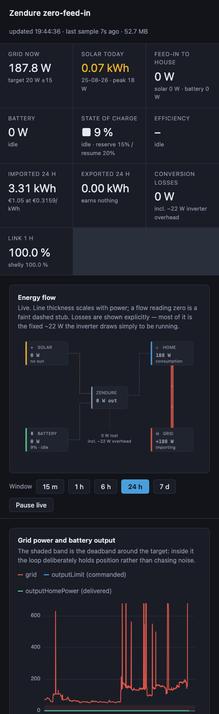

# Zendure ↔ Shelly zero-feed-in controller

Keeps household grid draw at **zero watts** by matching a Zendure SolarFlow 800
Plus battery's output to live demand — with the control loop running **on the
Shelly Pro 3EM energy meter itself**. No cloud, no MQTT broker, no home
automation platform, no always-on server for the control path.

A Raspberry Pi alongside it logs everything and serves a dashboard, but it is
deliberately *outside* the control path: if the Pi dies, regulation carries on.


## What it does

- **Regulates grid power to 0 W.** Reads the meter locally, computes a new
  battery setpoint, writes it over the Zendure's local HTTP API — every 5 s.
- **Uses solar directly rather than storing it first.** Sending 160 W of solar
  straight to the house delivers 131 W; storing and later discharging it
  delivers 103 W. Measured, not assumed.
- **Protects the battery** with a reserve floor and hysteresis, and never lets
  the solar-passthrough path quietly drain it.
- **Logs 82 fields at 5 s** into SQLite and serves a dependency-free dashboard.
- **Runs unattended.** Watchdog for silent lock-ups, survives reboots, degrades
  safely when the Wi-Fi link drops.

## The live energy flow

Every value on the card is read from a device or derived from readings that are.
Losses are shown explicitly, because they are where the watts that look missing
actually go — most of it the fixed ~22 W the inverter draws just to be running.


## History and diagnostics


The tracking-error panel separates two faults that look identical if you plot
only one of them: **regulation error** (how far grid power sits from target —
mistuned gain shows up as oscillation through zero) and **saturation gap** (what
the battery was asked for minus what it delivered — non-zero means it *could
not* comply, so the error is not a tuning problem at all).

## Measuring the hardware rather than trusting the spec sheet

The Zendure app enforces a 30 W minimum output. The hardware tracks accurately
down to **10 W**, so the floor is a software restriction — but it turns out to
be a well-chosen one.

Fitting 8,000+ steady-state samples gives a clean loss model:

```
P_dc = 1.03 × P_ac + 21.4 W        R² = 0.991 over 8,125 samples
```

A **fixed ~21 W overhead whenever the inverter converts**, plus ~97 % marginal
efficiency. That single constant explains the whole curve, and it puts
efficiency at ~57 % at 30 W and ~32 % at 10 W — almost exactly where the app
draws its line.


Consequence that changed the design: covering a 25 W standby load costs ~49 W of
stored solar, not 25 W.

## Engineering notes

Things this project turned up that were not obvious going in:

- **`batcur` is a signed int16 carried in an unsigned field.** Discharging reads
  as `65509`, i.e. −27 → −2.7 A. Read naively it is 6.5 kA and every derived
  figure is silently wrong.
- **The solar cap is feedback-controlled, not feed-forward.** PV→bus efficiency
  varies with irradiance, temperature and SoC, so a measured-once constant is
  wrong nearly everywhere. Battery current is directly observable, so the loop
  corrects itself against it — and only widens the cap when the cap is actually
  binding, so legitimate surplus charging cannot ratchet it open.
- **Sensor resolution bounds control resolution.** That feedback loop first
  drifted for hours: `batcur` resolves to ~5 W, and the target had been set
  finer than that, so the controller chased a setpoint it could never satisfy.
- **The control script is tested without hardware.** A simulated Shelly runtime
  ([`tools/simulate.js`](tools/simulate.js)) exercises the reserve gate,
  watchdog recovery, late callbacks from abandoned cycles, solar passthrough and
  controller convergence — 33 assertions, no device required.

Every tuning decision and the evidence behind it is recorded in
[docs/assumptions.md](docs/assumptions.md), which deliberately separates what
was **measured** from what was merely **assumed** — the assumptions are listed
so they can be argued with.

## How it fits together

```
  Shelly Pro 3EM ──── control loop (mJS, on-device) ────► Zendure 800 Plus
   (energy meter)         reads meter locally,              (local HTTP API)
         │                writes setpoint every 5s                  │
         │                                                          │
         └──────────► Raspberry Pi ◄─────────────────────────────────┘
                      collector + dashboard, read-only,
                      outside the control path
```

| Path | What |
| --- | --- |
| [`src/zendure-control.js`](src/zendure-control.js) | The control loop. Runs on the Shelly. |
| [`tools/deploy.py`](tools/deploy.py) | Renders config into the script and uploads it over the Shelly RPC API. |
| [`tools/collector.py`](tools/collector.py) | Polls both devices, stores a time series in SQLite. |
| [`tools/dashboard.py`](tools/dashboard.py) | Read-only web UI. Separate process from the collector. |
| [`tools/simulate.js`](tools/simulate.js) | Simulated Shelly runtime for testing without hardware. |
| [`web/index.html`](web/index.html) | The dashboard. Charts hand-drawn on canvas, zero dependencies. |
| [`docs/assumptions.md`](docs/assumptions.md) | Measured facts vs assumptions, and why each value is what it is. |
| [`docs/pi-setup.md`](docs/pi-setup.md) | Setting up the logging host. |

**Dependencies: none.** Python standard library on the Pi, mJS on the Shelly,
plain JavaScript in the browser. Nothing to vendor, nothing to keep current, and
it still works with no internet in five years.

<details>
<summary>Also runs on a phone</summary>



</details>

## Setup

```bash
cp config/config.example.json config/config.local.json
```

Fill in the two IPs, then confirm both devices answer:

```bash
tools/discover.sh <shelly-ip> <zendure-ip>
```

Deploy the control loop to the Shelly:

```bash
python3 tools/deploy.py
```

Watch it run:

```bash
python3 tools/deploy.py --logs
```

Stop it (also disables autostart-on-boot):

```bash
python3 tools/deploy.py --stop
```

For the logging host and dashboard, see [docs/pi-setup.md](docs/pi-setup.md).

## Config reference

### `meter`

- **`profile`** — `"triphase"` reads `em:0.total_act_power`; `"monophase"` sums
  `em1:0/1/2.act_power`. The Pro 3EM exposes one or the other depending on how
  it is configured. `tools/discover.sh` prints which one you have.
- **`importPositive`** — `true` if the meter reports positive watts when you are
  *drawing* from the grid. If the sign is flipped, the loop runs away in the
  wrong direction, so verify this before trusting it.

### `control`

- **`targetGridW`** — where you want grid power to sit. `0` is correct when the
  battery is solar-charged and export is uncompensated: importing and exporting
  then cost exactly the same, so no bias is justified. A positive value is only
  right if stored energy costs more than grid energy — e.g. a grid-charged
  battery on a flat tariff, where round-trip losses make discharging to cover
  baseload a net loss. See [docs/assumptions.md](docs/assumptions.md).
- **`deadbandW`** — errors smaller than this are ignored. Read this together
  with the target: a deadband of 15 around a target of 0 means the loop is
  content anywhere in ±15 W, so **widening the band is equivalent to raising the
  target**. Narrowing it costs more writes to the Zendure.
- **`gain`** — how much of the error to correct per cycle. `1.0` is deadbeat and
  oscillates in practice; `0.8` settles in a couple of cycles.
- **`maxStepW`** — cap on setpoint movement per cycle, so a kettle switching on
  doesn't slam the inverter from 0 to 800 W.
- **`minWriteDeltaW`** — skip the POST when the new setpoint barely differs from
  the current one. Reduces writes to the Zendure by a lot.
- **`basis`** — `"actual"` regulates from `outputHomePower` (what the battery is
  really delivering); `"limit"` regulates from `outputLimit` and reproduces the
  original forum script. `"actual"` avoids the setpoint winding up to 800 W when
  the battery is too empty to follow it.
- **`busyTimeoutCycles`** — watchdog. If an HTTP callback never fires, the cycle
  is abandoned after this many ticks and a fresh one starts. Without it a single
  lost callback stops the loop regulating *silently*, with no error anywhere.
- **`healthEveryCycles`** — how often to print the counters line (poll errors,
  write errors, watchdog trips). `120` at a 5 s interval is every 10 minutes.
  Set `0` to disable.

### `battery`

- **`reserveSoc`** — at or below this SoC, output is forced to 0. Enforced before
  the deadband and before the `minWriteDeltaW` economy, so neither can let a
  discharge slip through.
- **`resumeSoc`** — discharge only resumes once SoC has climbed back to here. The
  gap matters: with output at 0 the pack voltage relaxes and the reported SoC
  ticks up on its own, so a single threshold would re-enable discharge
  immediately and cycle the battery at its floor — exactly the wear the reserve
  exists to prevent.
- **`hysteresis`** — off by default, and unrelated to the reserve above. Moving
  the device's own `minSoc` to force charge/discharge switching was
  [reported broken on Zendure firmware ≥ 1.0.23](zendure-shelly-direct-shelly-script.md)
  (rapid toggling between 10–20 % SoC). The reserve gate needs no cooperation
  from the Zendure and is not affected by that bug.

Defaults are 15 % / 20 %, which keeps the battery clear of 10 % with margin for
SoC estimation drift. The Zendure's own `minSoc` (10 % out of the box) stays
untouched underneath as an independent backstop.

## Logging and dashboard

A Raspberry Pi polls both devices independently and stores the series; see
[docs/pi-setup.md](docs/pi-setup.md). The control loop is never in that data
path, so the logger cannot disturb regulation.

The dashboard shows grid power against the deadband, a tracking-error panel that
separates *regulation error* from *saturation gap*, state of charge, and inverter
efficiency binned by output power.

Every tuning decision and the evidence behind it is in
[docs/assumptions.md](docs/assumptions.md), which separates what was measured
from what was merely assumed.

## Testing

The control logic runs against a simulated Shelly environment — no hardware
needed. Covers the reserve gate, the watchdog, late callbacks from abandoned
cycles, and normal regulation:

```bash
python3 tools/deploy.py --build-only && node tools/simulate.js
```

## Prerequisite on the Zendure side

The Zendure must **not** be assigned to a HEMS integration in the Zendure app. A
HEMS continuously overwrites externally-written setpoints and this loop will
fight it.
